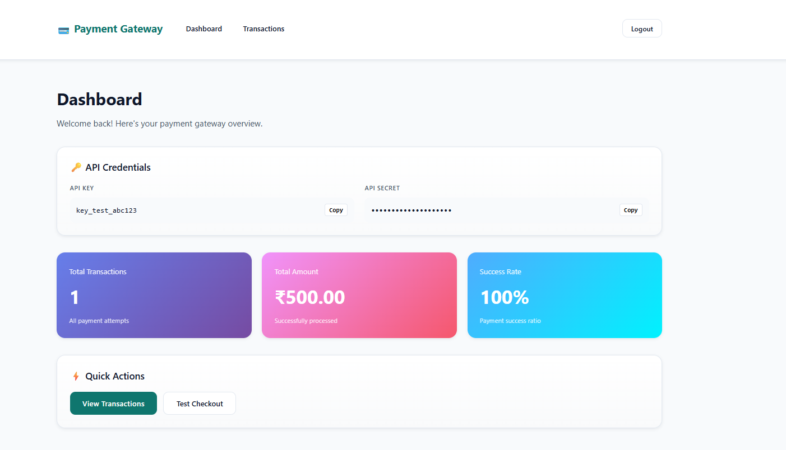

# 💳 Payment Gateway - Multi-Method Processing with Hosted Checkout

A complete payment gateway implementation similar to Razorpay/Stripe, supporting UPI and Card payments with a professional hosted checkout experience.

## 🎯 Features

- ✅ **RESTful API** - Order creation, payment processing, status tracking
- ✅ **Multi-Method Payments** - UPI (VPA validation) and Card (Luhn algorithm, network detection)
- ✅ **Merchant Dashboard** - Login, API credentials, transaction stats, payment history
- ✅ **Hosted Checkout** - Professional payment page with success/failure handling
- ✅ **Dockerized Deployment** - Single command setup with docker-compose
- ✅ **Database Persistence** - PostgreSQL with proper relationships and indexes
- ✅ **Authentication** - API key/secret for merchant endpoints
- ✅ **Payment Validation** - VPA format, Luhn algorithm, card network detection, expiry validation

## 🏗️ Architecture

```
┌─────────────┐         ┌─────────────┐         ┌──────────────┐
│  Dashboard  │────────▶│   Backend   │────────▶│  PostgreSQL  │
│  (Port 3000)│         │   API       │         │  Database    │
└─────────────┘         │  (Port 8000)│         └──────────────┘
                        └─────────────┘
                              ▲
                              │
                        ┌─────────────┐
                        │  Checkout   │
                        │  (Port 3001)│
                        └─────────────┘
```

## 📦 Tech Stack

- **Backend**: Node.js, Express.js, TypeORM
- **Database**: PostgreSQL 15
- **Frontend**: React 18, React Router, Axios
- **Styling**: CSS Variables, Responsive Design
- **Container**: Docker, Docker Compose
- **Authentication**: API Key/Secret pattern

## 🚀 Quick Start

### Prerequisites
- Docker & Docker Compose installed
- Git installed
- Ports 3000, 3001, 8000, 5432 available

### Installation

```bash
# 1. Clone repository
git clone https://github.com/lohithadamisetti123/payment-gateway.git
cd payment-gateway

# 2. Start all services
docker-compose up -d

# 3. Wait for services to be ready (30 seconds)
# All services will start automatically:
# - PostgreSQL database (auto-initialized with schema)
# - Backend API (auto-seeded with test merchant)
# - Dashboard frontend
# - Checkout page

# 4. Verify services are running
docker ps
curl http://localhost:8000/health
```

### Access URLs

- **Dashboard**: http://localhost:3000/login
- **Checkout**: http://localhost:3001/checkout?order_id=<order_id>
- **API**: http://localhost:8000
- **API Health**: http://localhost:8000/health

### Test Credentials

```
Email: test@example.com
Password: any (not validated in Deliverable 1)

API Key: key_test_abc123
API Secret: secret_test_xyz789
```

## 📚 API Documentation

### Base URL
```
http://localhost:8000
```

### Authentication
Protected endpoints require headers:
```
X-Api-Key: key_test_abc123
X-Api-Secret: secret_test_xyz789
```

### Endpoints

#### 1. Health Check
```bash
GET /health

Response 200:
{
  "status": "healthy",
  "database": "connected",
  "timestamp": "2024-01-15T10:30:00Z"
}
```

#### 2. Create Order
```bash
POST /api/v1/orders
Headers: X-Api-Key, X-Api-Secret
Body:
{
  "amount": 50000,
  "currency": "INR",
  "receipt": "receipt_123",
  "notes": { "customer_name": "John Doe" }
}

Response 201:
{
  "id": "order_NXhj67fGH2jk9mPq",
  "merchant_id": "550e8400-e29b-41d4-a716-446655440000",
  "amount": 50000,
  "currency": "INR",
  "status": "created",
  "created_at": "2024-01-15T10:30:00Z"
}
```

#### 3. Get Order
```bash
GET /api/v1/orders/{order_id}
Headers: X-Api-Key, X-Api-Secret

Response 200: (same as create order response)
```

#### 4. Create Payment
```bash
POST /api/v1/payments
Headers: X-Api-Key, X-Api-Secret

# UPI Payment
Body:
{
  "order_id": "order_NXhj67fGH2jk9mPq",
  "method": "upi",
  "vpa": "user@paytm"
}

# Card Payment
Body:
{
  "order_id": "order_NXhj67fGH2jk9mPq",
  "method": "card",
  "card": {
    "number": "4111111111111111",
    "expiry_month": "12",
    "expiry_year": "2025",
    "cvv": "123",
    "holder_name": "John Doe"
  }
}

Response 201:
{
  "id": "pay_H8sK3jD9s2L1pQr",
  "order_id": "order_NXhj67fGH2jk9mPq",
  "amount": 50000,
  "method": "upi|card",
  "status": "processing|success|failed",
  "created_at": "2024-01-15T10:31:00Z"
}
```

#### 5. Get Payment
```bash
GET /api/v1/payments/{payment_id}
Headers: X-Api-Key, X-Api-Secret

Response 200: (payment details with final status)
```

#### 6. Test Merchant (Evaluation Endpoint)
```bash
GET /api/v1/test/merchant

Response 200:
{
  "id": "550e8400-e29b-41d4-a716-446655440000",
  "email": "test@example.com",
  "api_key": "key_test_abc123",
  "seeded": true
}
```

### Public Endpoints (for Checkout Page)
```bash
GET /api/v1/orders/{order_id}/public
POST /api/v1/payments/public
```

## 🗄️ Database Schema

### Merchants Table
- `id` (UUID, PK)
- `name`, `email` (unique), `api_key` (unique), `api_secret`
- `webhook_url`, `is_active`, `created_at`, `updated_at`

### Orders Table
- `id` (VARCHAR, PK, format: "order_" + 16 chars)
- `merchant_id` (UUID, FK → merchants.id)
- `amount` (INTEGER, paise), `currency`, `receipt`, `notes` (JSONB)
- `status`, `created_at`, `updated_at`

### Payments Table
- `id` (VARCHAR, PK, format: "pay_" + 16 chars)
- `order_id` (VARCHAR, FK → orders.id)
- `merchant_id` (UUID, FK → merchants.id)
- `amount`, `currency`, `method`, `status`
- `vpa` (UPI), `card_network`, `card_last4` (Card)
- `error_code`, `error_description`
- `created_at`, `updated_at`

### Indexes
- `orders.merchant_id`
- `payments.order_id`
- `payments.status`

## ✅ Payment Validation

### VPA Validation
Pattern: `^[a-zA-Z0-9._-]+@[a-zA-Z0-9]+$`
- Valid: `user@paytm`, `john.doe@okhdfcbank`
- Invalid: `user @paytm`, `@paytm`, `user@@bank`

### Card Number (Luhn Algorithm)
- Validates checksum of card numbers (13-19 digits)
- Detects: Visa, Mastercard, Amex, RuPay
- Only last 4 digits stored (never full number or CVV)

### Card Network Detection
- **Visa**: Starts with 4
- **Mastercard**: Starts with 51-55
- **Amex**: Starts with 34 or 37
- **RuPay**: Starts with 60, 65, or 81-89

### Expiry Validation
- Must be future date (month/year ≥ current)
- Supports 2-digit (25) and 4-digit (2025) years

## 🎨 Screenshots

### Dashboard



### Checkout Page


## 🎥 Demo Video

Watch the complete payment flow demonstration: [Video Link](https://youtu.be/-Dsm5MRfrRQ?si=xe2Zm4GEwlq_LCqn)

## 🧪 Testing

### Manual Testing
```bash
# 1. Create Order
curl -X POST http://localhost:8000/api/v1/orders \
  -H "X-Api-Key: key_test_abc123" \
  -H "X-Api-Secret: secret_test_xyz789" \
  -H "Content-Type: application/json" \
  -d '{"amount":50000,"currency":"INR"}'

# 2. Copy order_id from response

# 3. Open checkout
open http://localhost:3001/checkout?order_id=<order_id>

# 4. Test UPI Payment
# VPA: test@paytm

# 5. Test Card Payment
# Card: 4111111111111111
# Expiry: 12/26
# CVV: 123
# Name: John Doe
```

### Test Mode
```bash
# Enable deterministic testing
echo "TEST_MODE=true" >> .env
echo "TEST_PAYMENT_SUCCESS=true" >> .env
echo "TEST_PROCESSING_DELAY=1000" >> .env

docker-compose restart api
```

## 🛠️ Development

### Project Structure
```
payment-gateway/
├── docker-compose.yml
├── .env.example
├── README.md
├── backend/
│   ├── Dockerfile
│   ├── package.json
│   ├── tsconfig.json
│   └── src/
│       ├── index.ts
│       ├── config/
│       ├── controllers/
│       ├── models/
│       ├── services/
│       └── middleware/
├── frontend/
│   ├── Dockerfile
│   ├── package.json
│   ├── nginx.conf
│   └── src/
│       ├── main.jsx
│       ├── styles.css
│       ├── pages/
│       └── components/
└── checkout-page/
    ├── Dockerfile
    ├── package.json
    ├── nginx.conf
    └── src/
        ├── main.jsx
        ├── styles.css
        └── pages/
```

### Local Development
```bash
# Backend
cd backend
npm install
npm run dev  # Runs on port 8000

# Frontend
cd frontend
npm install
npm run dev  # Runs on port 5173

# Checkout
cd checkout-page
npm install
npm run dev  # Runs on port 5174
```

## 📋 Environment Variables

See `.env.example` for all configuration options.

Key variables:
- `DATABASE_URL` - PostgreSQL connection string
- `PORT` - API server port (default: 8000)
- `TEST_MODE` - Enable deterministic payment outcomes
- `TEST_PAYMENT_SUCCESS` - Force success/failure in test mode
- `UPI_SUCCESS_RATE` - UPI payment success rate (0.90 = 90%)
- `CARD_SUCCESS_RATE` - Card payment success rate (0.95 = 95%)

## 🐳 Docker Commands

```bash
# Start all services
docker-compose up -d

# View logs
docker-compose logs -f
